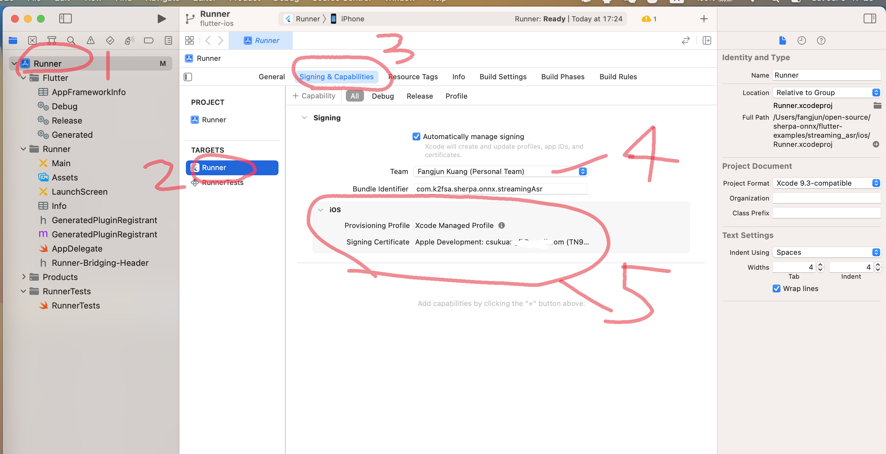
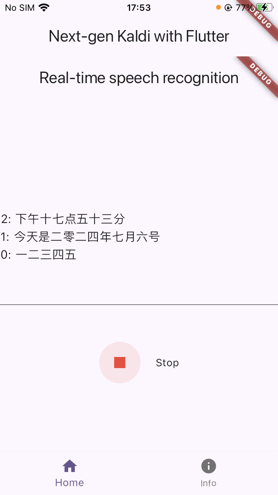
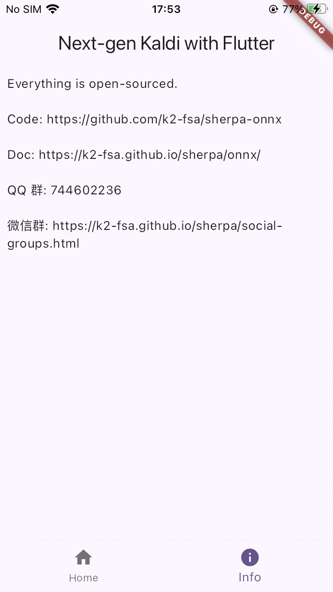

# Introduction

This directory contains flutter examples of `sherpa-onnx`.

# Ways to create an example
```bash
flutter create --platforms windows,macos streaming_asr
cd streaming_asr
flutter pub get

# to support a new platform, e.g., android, use

cd streaming_asr
flutter create --platforms --org com.k2fsa.sherpa.onnx android ./
```

To run with android, first use
```
(py38) fangjuns-MacBook-Pro:streaming_asr fangjun$ flutter run devices
No devices found yet. Checking for wireless devices...

No supported devices found with name or id matching 'android-arm64'.

The following devices were found:
Mi 10 (mobile)  • 61106679 • android-arm64  • Android 12 (API 31)
macOS (desktop) • macos    • darwin-x64     • macOS 13.1 22C65 darwin-x64
Chrome (web)    • chrome   • web-javascript • Google Chrome 126.0.6478.127
```
to find available devices. I have attached my Android phone (Xiaomi 10) to my computer
and it shows the device ID of my Android phone is `61106679`, so I use

```bash
(py38) fangjuns-MacBook-Pro:streaming_asr fangjun$ flutter run -d 61106679
```

to run it.

If you get the following errors and hint:

```
BUILD FAILED in 2m 43s
Running Gradle task 'assembleDebug'...                            165.3s

┌─ Flutter Fix ───────────────────────────────────────────────────────────────────────────────────────────────────┐
│ The plugin record_android requires a higher Android SDK version.                                                │
│ Fix this issue by adding the following to the file                                                              │
│ /Users/fangjun/open-source/sherpa-onnx/flutter-examples/streaming_asr/android/app/build.gradle:                 │
│ android {                                                                                                       │
│   defaultConfig {                                                                                               │
│     minSdkVersion 23                                                                                            │
│   }                                                                                                             │
│ }                                                                                                               │
│                                                                                                                 │
│                                                                                                                 │
│ Following this change, your app will not be available to users running Android SDKs below 23.                   │
│ Consider searching for a version of this plugin that supports these lower versions of the Android SDK instead.  │
│ For more information, see: https://docs.flutter.dev/deployment/android#reviewing-the-gradle-build-configuration │
└─────────────────────────────────────────────────────────────────────────────────────────────────────────────────┘
Error: Gradle task assembleDebug failed with exit code 1
```

Please use the following changes:

```diff
--- a/flutter-examples/streaming_asr/android/app/build.gradle
+++ b/flutter-examples/streaming_asr/android/app/build.gradle
@@ -38,7 +38,7 @@ android {
         applicationId = "com.k2fsa.sherpa.onnx.streaming_asr"
         // You can update the following values to match your application needs.
         // For more information, see: https://docs.flutter.dev/deployment/android#reviewing-the-gradle-build-configuration.
-        minSdk = flutter.minSdkVersion
+        minSdk = 23
         targetSdk = flutter.targetSdkVersion
         versionCode = flutterVersionCode.toInteger()
         versionName = flutterVersionName
```

If you get the following errors:

```
Launching lib/main.dart on Mi 10 in debug mode...
ERROR:/Users/fangjun/open-source/sherpa-onnx/flutter-examples/streaming_asr/build/record_android/intermediates/runtime_library_classes_jar/debug/clas
ses.jar: D8: com.android.tools.r8.internal.Hc: Sealed classes are not supported as program classes

FAILURE: Build failed with an exception.

* What went wrong:
Execution failed for task ':app:mergeLibDexDebug'.
> Could not resolve all files for configuration ':app:debugRuntimeClasspath'.
   > Failed to transform classes.jar (project :record_android) to match attributes {artifactType=android-dex, asm-transformed-variant=NONE, com.andro
id.build.api.attributes.AgpVersionAttr=7.3.0, com.android.build.api.attributes.BuildTypeAttr=debug, com.android.build.gradle.internal.attributes.Vari
antAttr=debug, dexing-enable-desugaring=true, dexing-enable-jacoco-instrumentation=false, dexing-is-debuggable=true, dexing-min-sdk=23, org.gradle.ca
tegory=library, org.gradle.jvm.environment=android, org.gradle.libraryelements=jar, org.gradle.usage=java-runtime, org.jetbrains.kotlin.platform.type
=androidJvm}.
      > Execution failed for DexingWithClasspathTransform: /Users/fangjun/open-source/sherpa-onnx/flutter-examples/streaming_asr/build/record_android
/intermediates/runtime_library_classes_jar/debug/classes.jar.
         > Error while dexing.

* Try:
> Run with --stacktrace option to get the stack trace.
> Run with --info or --debug option to get more log output.
> Run with --scan to get full insights.

* Get more help at https://help.gradle.org

BUILD FAILED in 2m 10s
```

Please refer to <https://github.com/llfbandit/record/blob/master/record_android/README.md>
to make the following changes

```diff
diff --git a/flutter-examples/streaming_asr/android/settings.gradle b/flutter-examples/streaming_asr/android/settings.gradle
index 536165d3..9b1a1012 100644
--- a/flutter-examples/streaming_asr/android/settings.gradle
+++ b/flutter-examples/streaming_asr/android/settings.gradle
@@ -18,7 +18,7 @@ pluginManagement {

 plugins {
     id "dev.flutter.flutter-plugin-loader" version "1.0.0"
-    id "com.android.application" version "7.3.0" apply false
+    id "com.android.application" version "7.4.2" apply false
     id "org.jetbrains.kotlin.android" version "1.7.10" apply false
 }
```

# ios
To support ios, run
```bash
cd streaming_asr
flutter create --platforms ios ./
```

Connect your iPhone to the computer, and run `flutter devices`, which will print:

```bash
Found 3 connected devices:
  iPhone (mobile) • 00008030-001064212E85802E • ios            • iOS 16.3 20D47
  macOS (desktop) • macos                     • darwin-x64     • macOS 13.1 22C65 darwin-x64
  Chrome (web)    • chrome                    • web-javascript • Google Chrome 126.0.6478.127

No wireless devices were found.

Run "flutter emulators" to list and start any available device emulators.

If you expected another device to be detected, please run "flutter doctor" to diagnose potential issues. You may also try increasing the time to wait
for connected devices with the "--device-timeout" flag. Visit https://flutter.dev/setup/ for troubleshooting tips.
```

Then run
```
flutter run -d 00008030-001064212E85802E
```

It will show:
```
Launching lib/main.dart on iPhone in debug mode...
════════════════════════════════════════════════════════════════════════════════
No valid code signing certificates were found
You can connect to your Apple Developer account by signing in with your Apple ID
in Xcode and create an iOS Development Certificate as well as a Provisioning
Profile for your project by:
  1- Open the Flutter project's Xcode target with
       open ios/Runner.xcworkspace
  2- Select the 'Runner' project in the navigator then the 'Runner' target
     in the project settings
  3- Make sure a 'Development Team' is selected under Signing & Capabilities > Team.
     You may need to:
         - Log in with your Apple ID in Xcode first
         - Ensure you have a valid unique Bundle ID
         - Register your device with your Apple Developer Account
         - Let Xcode automatically provision a profile for your app
  4- Build or run your project again
  5- Trust your newly created Development Certificate on your iOS device
     via Settings > General > Device Management > [your new certificate] > Trust

For more information, please visit:
  https://developer.apple.com/library/content/documentation/IDEs/Conceptual/
  AppDistributionGuide/MaintainingCertificates/MaintainingCertificates.html

Or run on an iOS simulator without code signing
════════════════════════════════════════════════════════════════════════════════
Error: No development certificates available to code sign app for device deployment
```

Follow the above instructions.

The following is a screenshot.



Then close `xcode` and run again

```bash
flutter run -d 00008030-001064212E85802E
```

You would get the following errors:
```
Error (Xcode): Undefined symbol: ___cxa_pure_virtual


Error (Xcode): Undefined symbol: ___cxa_throw


Error (Xcode): Undefined symbol: ___gxx_personality_v0


Error launching application on iPhone.
```

Make the following changes:

```diff
diff --git a/flutter-examples/streaming_asr/ios/Runner.xcodeproj/project.pbxproj b/flutter-examples/streaming_asr/ios/Runner.xcodeproj/project.pbxproj
index b208c7e9..466b0afb 100644
--- a/flutter-examples/streaming_asr/ios/Runner.xcodeproj/project.pbxproj
+++ b/flutter-examples/streaming_asr/ios/Runner.xcodeproj/project.pbxproj
@@ -482,6 +482,7 @@
 				PRODUCT_NAME = "$(TARGET_NAME)";
 				SWIFT_OBJC_BRIDGING_HEADER = "Runner/Runner-Bridging-Header.h";
 				SWIFT_VERSION = 5.0;
+				OTHER_LDFLAGS = "-lc++";
 				VERSIONING_SYSTEM = "apple-generic";
 			};
 			name = Profile;
@@ -500,6 +501,7 @@
 				SWIFT_ACTIVE_COMPILATION_CONDITIONS = DEBUG;
 				SWIFT_OPTIMIZATION_LEVEL = "-Onone";
 				SWIFT_VERSION = 5.0;
+				OTHER_LDFLAGS = "-lc++";
 				TEST_HOST = "$(BUILT_PRODUCTS_DIR)/Runner.app/$(BUNDLE_EXECUTABLE_FOLDER_PATH)/Runner";
 			};
 			name = Debug;
@@ -516,6 +518,7 @@
 				PRODUCT_BUNDLE_IDENTIFIER = com.k2fsa.sherpa.onnx.streamingAsr.RunnerTests;
 				PRODUCT_NAME = "$(TARGET_NAME)";
 				SWIFT_VERSION = 5.0;
+				OTHER_LDFLAGS = "-lc++";
 				TEST_HOST = "$(BUILT_PRODUCTS_DIR)/Runner.app/$(BUNDLE_EXECUTABLE_FOLDER_PATH)/Runner";
 			};
 			name = Release;
@@ -532,6 +535,7 @@
 				PRODUCT_BUNDLE_IDENTIFIER = com.k2fsa.sherpa.onnx.streamingAsr.RunnerTests;
 				PRODUCT_NAME = "$(TARGET_NAME)";
 				SWIFT_VERSION = 5.0;
+				OTHER_LDFLAGS = "-lc++";
 				TEST_HOST = "$(BUILT_PRODUCTS_DIR)/Runner.app/$(BUNDLE_EXECUTABLE_FOLDER_PATH)/Runner";
 			};
 			name = Profile;
@@ -666,6 +670,7 @@
 				SWIFT_OBJC_BRIDGING_HEADER = "Runner/Runner-Bridging-Header.h";
 				SWIFT_OPTIMIZATION_LEVEL = "-Onone";
 				SWIFT_VERSION = 5.0;
+				OTHER_LDFLAGS = "-lc++";
 				VERSIONING_SYSTEM = "apple-generic";
 			};
 			name = Debug;
@@ -688,6 +693,7 @@
 				PRODUCT_NAME = "$(TARGET_NAME)";
 				SWIFT_OBJC_BRIDGING_HEADER = "Runner/Runner-Bridging-Header.h";
 				SWIFT_VERSION = 5.0;
+				OTHER_LDFLAGS = "-lc++";
 				VERSIONING_SYSTEM = "apple-generic";
 			};
 			name = Release;
```

Then re-run
```bash
flutter run -d 00008030-001064212E85802E
```

Finally, it shows the following:

```
Launching lib/main.dart on iPhone in debug mode...
Automatically signing iOS for device deployment using specified development team in Xcode project: N5ZH3Z63A6
Running Xcode build...
 └─Compiling, linking and signing...                         9.0s
Xcode build done.                                           25.6s
(lldb) 2024-07-06 17:43:54.970077+0800 Runner[4851:965716] [SceneConfiguration] Info.plist contained no UIScene configuration dictionary (looking for configuration named "(no name)")
Warning: Unable to create restoration in progress marker file
fopen failed for data file: errno = 2 (No such file or directory)
Errors found! Invalidating cache...
fopen failed for data file: errno = 2 (No such file or directory)
Errors found! Invalidating cache...
Installing and launching...                                        31.8s
Syncing files to device iPhone...                                1,080ms

Flutter run key commands.
r Hot reload. 🔥🔥🔥
R Hot restart.
h List all available interactive commands.
d Detach (terminate "flutter run" but leave application running).
c Clear the screen
q Quit (terminate the application on the device).

A Dart VM Service on iPhone is available at: http://127.0.0.1:51556/QDn_7CJ2gzk=/
The Flutter DevTools debugger and profiler on iPhone is available at: http://127.0.0.1:9100?uri=http://127.0.0.1:51556/QDn_7CJ2gzk=/
```

If it shows the following log after pressing `start` within the sherpa-onnx APP on your iPhone:

```
[access] This app has crashed because it attempted to access privacy-sensitive data without a usage description.  The app's Info.plist must contain an NSMicrophoneUsageDescription key with a string value explaining to the user how the app uses this data.
```

Please make the following changes
```diff
--- a/flutter-examples/streaming_asr/ios/Runner/Info.plist
+++ b/flutter-examples/streaming_asr/ios/Runner/Info.plist
@@ -2,6 +2,8 @@
 <!DOCTYPE plist PUBLIC "-//Apple//DTD PLIST 1.0//EN" "http://www.apple.com/DTDs/PropertyList-1.0.dtd">
 <plist version="1.0">
 <dict>
+       <key>NSMicrophoneUsageDescription</key>
+       <string>Need microphone access for recording speech</string>
        <key>CFBundleDevelopmentRegion</key>
        <string>$(DEVELOPMENT_LANGUAGE)</string>
        <key>CFBundleDisplayName</key>
```

And re-run

```
flutter run -d 00008030-001064212E85802E
```

The following are some screenshots of the iOS app:

|1|2|3|
|---|---|---|
||||

